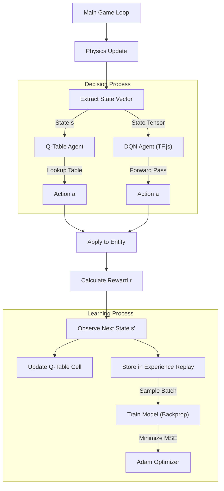

# NEON RL ARENA: Optimized Learning Framework

 


> **ブラウザベースのマルチエージェント強化学習比較実験ラボ。**  
> **古典的なQ-Learningと深層強化学習（DQN）が、ネオン輝くサイバーパンク空間でリアルタイムに競演する技術デモンストレーション。**

本プロジェクトは、HTML5 Canvasと**TensorFlow.js**を活用して構築された、高度な強化学習（Reinforcement Learning: RL）シミュレーターです。
ユーザーは、従来の **表形式Q学習（Tabular Q-Learning）** と、ニューラルネットワークを用いた **DQN（Deep Q-Network）** のエージェントが、同一の環境下でどのように学習・適応していくかを視覚的かつ定量的に比較検証できます。

## 🔗 Live Demo
[View Demo on GitHub Pages](https://funmatu.github.io/q-learning-runner-web/)
*(※注: 初回ロード時にGPUバックエンドの初期化処理が走ります)*

---

## 1. プロジェクト概要と目的

`NEON RL ARENA` は、単なるゲームAIのデモを超え、異なる強化学習アルゴリズムの特性（収束速度、安定性、汎化能力）を直感的に理解するために設計されました。

### 主な特徴

1.  **マルチエージェント並列実行:**
    *   **Manual Lane:** 人間による操作（ベースライン）。
    *   **Q-Table Lane:** 離散化された状態空間を持つ古典的エージェント。
    *   **DQN Lane:** ニューラルネットワークによる関数近似を行う深層学習エージェント。
    これら3つのレーンが独立したインスタンスとして同時に動作・学習します。

2.  **WebGL GPU Acceleration:**
    *   TensorFlow.jsのWebGLバックエンドを利用し、ブラウザ上でニューラルネットワークの学習（勾配計算・バックプロパゲーション）を高速に実行します。

3.  **リアルタイム・メトリクス可視化 (HUD):**
    *   **Loss (損失関数):** NNの学習誤差の推移。
    *   **Q-Values (価値推定):** 現在の状態に対する行動価値（Run vs Jump）の確信度。
    *   **Epsilon (探索率):** 「探索（Exploration）」と「活用（Exploitation）」のバランス推移。
    *   **TensorFlow.js Internals:** メモリ使用量やバックエンドの状態。

---

## 2. システムアーキテクチャ

本システムは、**Environment（環境）**、**Agent（エージェント）**、**Visualization（可視化）**の3層構造で設計されています。

### 2.1 技術スタック詳細

| コンポーネント | 技術選定 | 役割 |
| :--- | :--- | :--- |
| **Frontend** | Vanilla JavaScript (ES6+) | ゲームループ、DOM操作、イベントハンドリング |
| **Deep Learning** | **TensorFlow.js** | ニューラルネットワーク構築、GPU演算、テンソル管理 |
| **Rendering** | HTML5 Canvas API | 60FPSの物理描画、ネオンエフェクト、パーティクル |
| **Styling** | CSS3 (Variables) | ガラスモーフィズムUI、レスポンシブレイアウト |

### 2.2 データフロー・ダイアグラム



---

## 3. 環境と状態定義 (Environment & State Space)

すべてのエージェントは共通の物理法則と報酬体系を持つ環境下で動作します。

### 3.1 状態ベクトル (Observation Space)

エージェントが観測する世界は、人間が見ているピクセル情報ではなく、以下のように正規化された**4次元の特徴量ベクトル**です。

| インデックス | 特徴量名称 | 定義・正規化 | 重要性 |
| :--- | :--- | :--- | :--- |
| `0` | **TTI (Time To Impact)** | `(障害物X - プレイヤーX) / 速度` <br> [0.0 - 2.0] にクリップ | 最も重要な指標。衝突までの猶予時間。 |
| `1` | **Obstacle Width** | `障害物幅 / 150.0` <br> [0.0 - 1.0] | 障害物の大きさを認識し、ジャンプの必要性を判断。 |
| `2` | **Is Grounded** | `1.0` (接地) or `0.0` (空中) | 空中ジャンプ（二段ジャンプ）不可の制約を理解させる。 |
| `3` | **Normalized Speed** | `(現在速度 - 最小) / (最大 - 最小)` <br> [0.0 - 1.0] | 速度上昇に伴う慣性の変化に対応するため。 |

### 3.2 行動空間 (Action Space)

離散的な2つの行動のみが許可されます。

*   **Action 0:** `RUN` (何もしない / 待機)
*   **Action 1:** `JUMP` (ジャンプを実行)

### 3.3 報酬設計 (Reward Shaping)

エージェントの行動指針となる報酬関数 $R(s, a)$ は以下のように設計されています。

*   **生存報酬:** `+0.01` / frame (接地時のみ。無駄なジャンプを抑制)
*   **障害物通過:** `+0.5` (障害物を越えることに成功)
*   **衝突 (死亡):** `-1.0` (エピソード終了)
*   **ペナルティ (ジャンプコスト):**
    *   TTI > 0.6 (早すぎるジャンプ): `-0.5`
    *   TTI < 0.1 (遅すぎるパニックジャンプ): `-0.5`
    *   通常ジャンプコスト: `-0.05` (エネルギー効率の観点)

---

## 4. 強化学習アルゴリズム詳細

### 4.1 Agent A: 古典的 Q-Learning (Tabular)

状態空間を離散化（ビン分割）し、ルックアップテーブルを用いて学習します。

#### 特徴
*   **離散化ロジック:** 連続値であるTTI（衝突猶予時間）を「危険」「注意」「安全」などの離散的なビンに分割してキー生成します。
    *   Key例: `"TTI_Bin:Speed_Bin:Grounded"`
*   **更新式:**
    $$Q(s, a) \leftarrow Q(s, a) + \alpha [r + \gamma \max_{a'} Q(s', a') - Q(s, a)]$$
*   **長所:** 計算コストが極めて低く、小規模な状態空間では収束が速い。
*   **短所:** 未知の状態（ビンの境界など）への汎化能力がない。状態が増えるとメモリ使用量が爆発する。

### 4.2 Agent B: Deep Q-Network (DQN)

TensorFlow.jsを用いたニューラルネットワークによる関数近似モデルです。DeepMindがAtariゲームで示したモデルをベースに軽量化しています。

#### ネットワーク構造 (Architecture)
```text
Input Layer (4 neurons)  : State Vector
    ↓
Dense Layer (24 neurons) : Activation = ReLU, KernelInit = HeNormal
    ↓
Dense Layer (24 neurons) : Activation = ReLU, KernelInit = HeNormal
    ↓
Output Layer (2 neurons) : Activation = Linear (Q-Values for Run/Jump)
```

#### 学習メカニズム (Advanced Features)
DQNの学習を安定させるため、以下の最新手法を取り入れています。

1.  **Experience Replay (経験再生):**
    *   エージェントの経験 `(s, a, r, s', done)` をメモリバッファ（サイズ: 20,000）に保存。
    *   学習時にそこからランダムにミニバッチ（サイズ: 64）を取り出して学習。これにより、データの時間的相関を断ち切り、学習を安定化させます。

2.  **Target Network (ターゲットネットワーク):**
    *   学習対象の「Main Network」とは別に、重みを固定した「Target Network」を用意し、目標値（正解ラベル）の計算に使用します。
    *   $$Target = r + \gamma \max_{a'} Q_{target}(s', a')$$
    *   Target Networkの重みは、一定ステップ（200 frames）ごとにMain Networkから同期されます。これにより発散（振動）を防ぎます。

3.  **Optimizer:**
    *   **Adam (Adaptive Moment Estimation)** を採用。学習率 `lr = 0.0005`。

---

## 5. ハイパーパラメータ設定

本シミュレーションで使用されている主要な設定値です。`index.html`内の定数定義で変更可能です。

### 強化学習設定 (`RL_CONFIG`)

| パラメータ | 値 | 説明 |
| :--- | :--- | :--- |
| **Gamma ($\gamma$)** | `0.95` | 割引率。0に近いほど近視眼的、1に近いほど将来的報酬を重視。リアクションゲームのためやや短期重視。 |
| **Learning Rate** | `0.0005` | Adamオプティマイザの学習率。安定性のため低めに設定。 |
| **Epsilon Start** | `1.0` | 初期の探索率（100%ランダム）。 |
| **Epsilon Decay** | `0.99` | エピソードごとの減衰率。徐々に「活用」モードへ移行。 |
| **Epsilon Min** | `0.01` | 最終的な最小探索率（1%は常に探索し続ける）。 |
| **Batch Size** | `64` | 一度の学習に使用する経験サンプルの数。 |
| **Memory Size** | `20000` | Experience Replay Bufferの最大容量。 |
| **Train Frequency** | `4` | 4フレームごとに1回学習ステップを実行（計算負荷軽減のため）。 |

### 物理設定 (`CONFIG`)

| パラメータ | 値 | 説明 |
| :--- | :--- | :--- |
| **Gravity** | `0.65` | 重力加速度。 |
| **Jump Force** | `-13` | ジャンプ初速度。 |
| **Base Speed** | `7` | 初期のスクロール速度。 |
| **Max Speed** | `25` | 最大スクロール速度。 |

---

## 6. セットアップと実行方法

### 必要要件
*   **Webブラウザ:** Chrome, Firefox, Edge, Safari (最新版推奨)
    *   *推奨: WebGL 2.0をサポートし、GPUアクセラレーションが有効な環境*
*   **インターネット接続:** TensorFlow.jsをCDNからロードするために必要です。

### ローカルでの実行

本プロジェクトはビルドプロセス（Webpack/Vite等）を必要としない構成になっています。

1.  **リポジトリのクローン:**
    ```bash
    git clone https://github.com/funmatu/q-learning-runner-web.git
    cd q-learning-runner-web
    ```

2.  **実行:**
    `index.html` をブラウザにドラッグ＆ドロップするか、VS Codeの "Live Server" 等で開いてください。

### UI操作ガイド

*   **Mode Switch:**
    *   `TRAINING`: 学習モード。衝突時に罰を与え、モデルを更新します。
    *   `TESTING`: 推論モード。学習（重み更新・Epsilon探索）を停止し、現在の実力で走行します。
*   **Manual Toggle:**
    *   ONにすると、最下段にマニュアル操作レーン（人間用）が表示されます。`Space`キーまたはタップでジャンプします。
*   **HUDの見方:**
    *   **LOSS:** 数値が減少傾向にあれば、NNが正しく予測精度を上げている証拠です。
    *   **Q-VALS:** エージェントが現在の状況をどう評価しているか（RUNとJUMPの期待値）。
    *   **EPSILON:** 黄色のバー。これが短くなるにつれて、AIの動きがランダムから意図的なものに変わります。

---

## 7. トラブルシューティング

*   **動作が重い場合:**
    *   ブラウザのハードウェアアクセラレーションが有効か確認してください。
    *   コンソールに `GPU: FAILED (CPU MODE)` と表示されている場合、CPUでニューラルネットを計算しているため極端に遅くなります。
*   **AIが学習しない:**
    *   DQNは初期の学習に時間がかかります（Memory Bufferがある程度溜まるまで学習が開始されません）。少なくとも10〜20エピソードは見守ってください。
    *   ブラウザのタブがバックグラウンドに行くと`requestAnimationFrame`が停止し、学習も止まります。

---

## 8. ロードマップと今後の展望

*   [x] **Phase 1:** 基本的なQ-Learningの実装（完了）
*   [x] **Phase 2:** TensorFlow.jsによるDQNの実装とGPU対応（完了）
*   [x] **Phase 3:** マルチレーン比較システムの構築（完了）
*   [ ] **Phase 4:** Double DQN (DDQN) / Dueling DQN へのアルゴリズム拡張
*   [ ] **Phase 5:** CNN（畳み込みニューラルネット）を用いた、ピクセルベース（画像入力）での学習対応
*   [ ] **Phase 6:** 学習済みモデルの Save/Load 機能（IndexedDBまたはJSONファイル出力）

---

## 9. ライセンス

Copyright (c) 2025 Funmatu

本ソフトウェアは **MIT License** の下で公開されています。商用・非商用を問わず、自由に使用、改変、配布することが可能です。詳細は [LICENSE](LICENSE) ファイルをご確認ください。

---

*Made with ❤️ using TensorFlow.js and Cyberpunk Spirit.*
